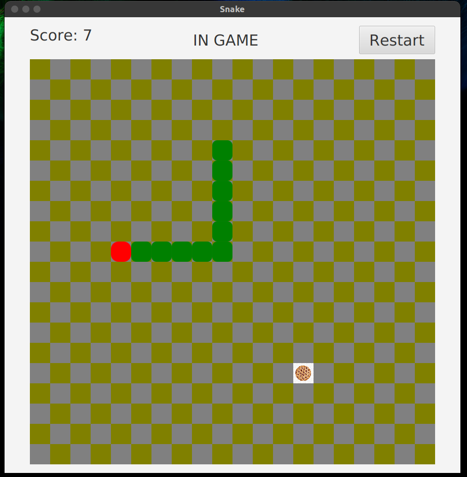

### The Snake

A simple snake game in java.
Using JavaFx to display.  Written on January 24.
If you have any questions of this project - shoot. 

### How it looks

Also, you can watch game
<a href="https://drive.google.com/file/d/1nojIAAmxxn4FVLQNRoqLYzyRiB_gofzb/view?usp=sharing" target="_blank">video</a> on my Google Drive

### How to run it
* you must have jdk 8
* you must give permission to execute `./start` file
* you must run `./start` file